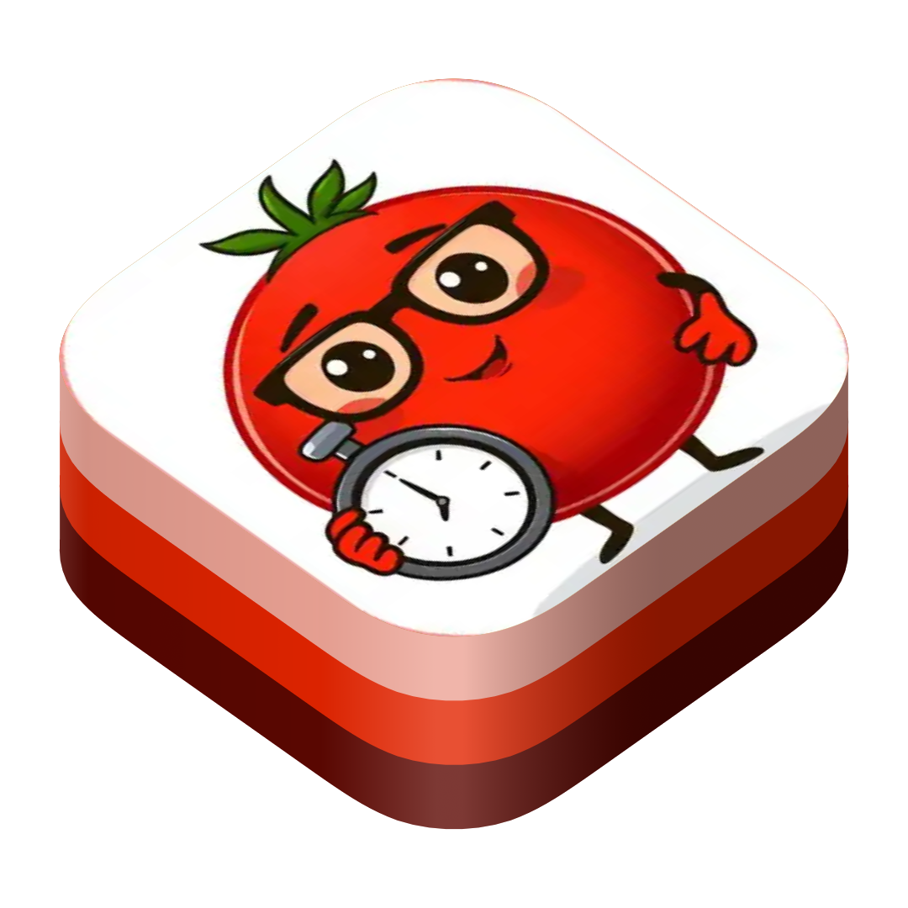
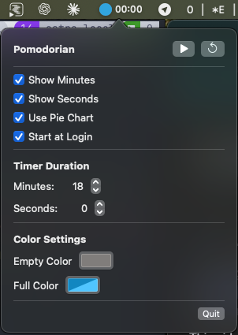

<p align="center">
  
</p>

# Pomodorian

A minimal, vibe-coded macOS menu bar Pomodoro timer that was designed, scripted, and iterated without ever launching full-fat Xcode.

<p align="center">
  
</p>

## Highlights
- ~400 KB release binary; the bundle is bigger only because this icon is fancy.
- Lives entirely in the status bar—no stray windows, just a timer and a vibe.
- Built as a Claude Sonnet 3.7 playground for native Mac development experiments.
- Includes repeatable scripts for rebuilding, validating the icon asset, and tidying whitespace.

## Story & Workflow
I wanted to see how far I could go pairing Claude Sonnet 3.7 with a fully native SwiftUI app while staying inside lightweight tooling. Pomodorian is the proof-of-concept. I meant to archive the whole prompt log, but it was lost, so the repo now acts as the working notes for that experiment.

Design tweaks and bug fixes were driven by annotated screenshots—check the `VibingScreenshots/` folder for before/after shots and commentary that documents how visual issues were spotted and resolved.

## Helper Scripts
- `scripts/try_accept.sh` – kills any running instance, rebuilds, and launches the menu bar app so you can quickly inspect changes.
- `scripts/test_icon.sh` – verifies the `PomodorianIcon.png` asset is properly embedded; super handy when Finder insists on showing the default icon.
- `scripts/fix_whitespace.sh` – normalizes whitespace so diffs stay small and reviewable.

## Installation & Run
1. Install Xcode command-line tools (or full Xcode) so the macOS SDK is available.
2. Build the app:
   ```
   ./build.sh
   ```
3. Launch it straight from the build output or move it into `/Applications`:
   ```
   open build/Pomodorian.app
   ```
4. Prefer cycling via the helper script while iterating?
   ```
   ./scripts/try_accept.sh
   ```
